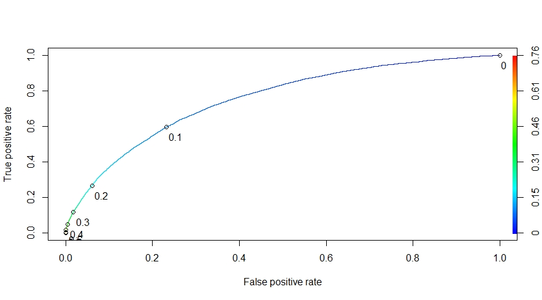
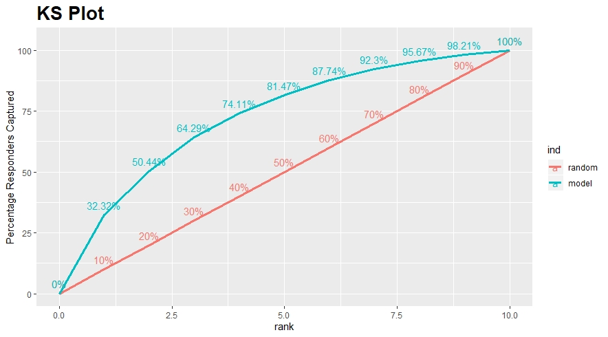
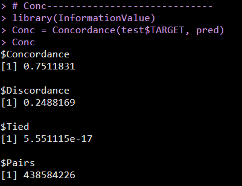
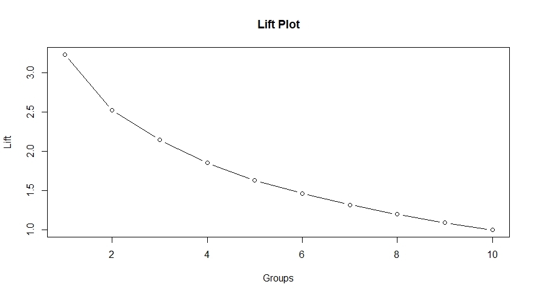

# Homecredit-Kaggle

Problem Statement:
Predicting whether or not a client will repay a loan or have difficulty is a critical business need, and 
Home Credit is hosting this competition on Kaggle to see what sort of models the machine learning community can develop to help them in 
this task.

Our aim is to build a Credit Risk Model which tells the probability of a person being a default. This model is built on different data like
POS, Demographics, Previous installments, credit history etc.

For more details visit: https://www.kaggle.com/c/home-credit-default-risk/overview

Here, we used Logistic Regression because of its wonderful interpretability.

We used techniques like WOE, Information Value and using them done fine and coarse classing.

The Python file will show step by step process of fine and coarse classing

The R file will show the implementation using the built in libraries.

Here are some of the evaluation metrics for the build model:

AucROC Score: 0.75
 
 
KS Plot:
 

Concordance:
 
 
 
Lift:
 
 
 
 

